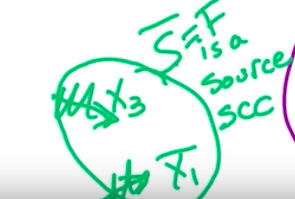

**SAT: notation**

Def

Boolean formula with n variables x~1~...x~n~

2 n literals x~1~, !x~1~, x~2~, !x~2~ etc

∧ (And)

∨ (Or)

CNF = Conjunctive Normal Form Clause: OR of several literals

Formula F in CNF is AND of n clauses

*SAT problem*

Input: Formula F in CNF with n variabls and m clauses

Output: Assignment (assign T or F to each variable) satysfying if one
exists, NO if no exists

k-SAT problem: clauses are of same max size k

2-SAT problem: Clauses are of max size 2. In particular, because we can
reduce all 1-size clauses we end up with all clauses having size
precisely 2.

*Graph of implications*

If paths x~1~--> !x~1~ and !x~1~ --> x~1~ then f is not satisfiable (x
cannot be both true and false) --> means that they are in same SCC

*Lemma*

If for some i, x~i~ and !x~i~ are in same SCC, then f is not
satisfiable. If for all i, x~i~ and !x~i~ are in different SCCs then f
is satisfiable --> proof by finding a satisfiable assignment

We worry about edges T-> T. If they start with F we don't care

*Algorithm ideas*

1. Take sink SCCs, set S= T (satisfy all literals in S)
2. Remove S  and repeat

For all source SCCs, we set it to false

*2-SAT algorithm*

Key fact: If for all i, x~i~ and !x~i~ are in different SCCs then S is a
sink SCC <-> S' is a source SCC

**S-SAT (F)**

1. Simplify f so that each clause if exaclty of size 2
2. Construct graph G for f
3. Run DFS
4. Take a sink SCC S
   - Set S= T (and S' = F)
   - Remove S and S'
   - Repeat until empty

O(n+m)

