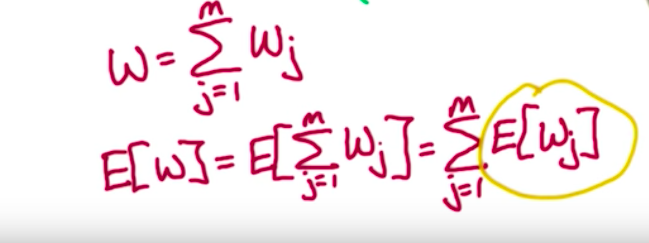

**Max SAT**

Input: Boolean formula f in CNF (conjuctive normal form) with n variables and 
m clauses

Output: Assignment maximising number of satisfied clauses

SAT is NP-complete
Max-SAT is NP-hard

Let m* denote the max number of satisfied clauses -> clearly m* <=m

_Randomised algorithm_

Expected number of satisified clauses

(One half approximation algorithm)

If all clauses are of same size (example -3) this simple algorithm performs very well
In fact, it is NP hard to do better.

For general size of clause = k. it performs with expectation (1-2^(-k)^)

This algorithm can be derandomizes using the method of conditional probabilities (we assign T or F for all variables and look
at probability of the how many clauses get satisfied, picking the more optimal)

_(1-1/e) approximation_ 

Max-SAT problem can be reduced to Integer LP problem 

And Integer LP problem can be approximated by dropping the integer contraint, solving the more general LP problem

and rounding the solution to nearest integer - solution obtained in this way may not be optimal, but it is not too far off

**Summary**

Take NP-hard problem
    -reduce to ILP
    - relax to LP & solve
    - randomized round
    
Randomised algotithm tend to perform better for big k and LP scheme tends to perform better for small k

Conclusion -> best of 2

- Run simple algorithm - get m1
- Run LP scheme - get m2
- Take better of 2

E[max { m1, m2}] >= (3/4)m*